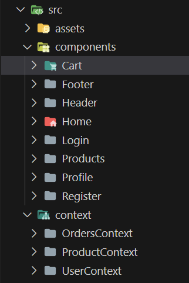

# E-commerce Online Shopping
_Ecommerce es un proyecto de simulación de página web en el que se recrearán diversas operaciones de una tienda online. Este proyecto esta combinado con los conocimientos adquiridos en las
tecnologías React, JavaScript, HTML, SCSS y Context, además de mysql/sequelize como base de backend para implementar el frontend._

---
## Objetivos 🚀
Una vez analizadas las necesidades del proyecto, se espera
que el alumno desarrolle un frontend que sea capaz de lo siguiente:
* Registro de usuarios.
* Login de usuarios.
* Que se puedan ver los productos  y añadir al carrito de compra
* Que se pueda crear pedidos
* Que en tu perfil puedas ver tus datos
---

## Estructura de codigo con React utilizando Context ⚙️

Primero hemos desarrollado la estructura en VScode generando el proyecto con React&Vite



Como se muestra en imagen, hemos generado los componentes de nuestra página web y los distintos contextos necesarios para darle funcionalidad a los componentes. A partir de aqui, iremos describiendo el flujo de interacción que hemos ido desarrollando para dotar de la funcionalidad requerida en nuestra página web.

---
### *Componente 🔩

Primero montamos la carpeta del componente y los archivos requeridos(.jsx y scss), importando React y exportando dicho compomente en en el archivo App.jsx en el que iremos mostrando nuestras rutas ya definidas a través de React Router.

```js
import React, { useContext, useEffect } from 'react'
import { ProductContext } from '../../context/ProductContext/ProductState'
import { OrdersContext } from '../../context/OrdersContext/OrdersState'
import { Button, Empty, notification } from 'antd'
import {ShoppingCartOutlined } from '@ant-design/icons'
import "./Cart.scss"
import { Space, Table, Tag } from 'antd';

const Cart = () => {
    const {cart, clearCart} = useContext(ProductContext)
    const {createNewOrder} = useContext(OrdersContext)
    const columns = [
      {
        title: 'Name',
        dataIndex: 'name',
        key: 'name',
        render: (text) => <a>{text}</a>,
      },
      {
        title: 'Price €',
        dataIndex: 'price',
        key: 'price',
      },
      {
        title: 'Image',
        key: 'image',
        render: (_, record) => (
          <Space size="middle" className="imgCart">
  
          </Space>
        ),
      },
    ];
    useEffect(() => {
        localStorage.setItem("cart", JSON.stringify(cart));
      }, [cart]);
    

    if (cart.length < 1) {
        return <div className='cart-container'>
          <Empty description = {
            <span>
              No hay productos
            </span>
          }/>
        </div> 
      }
    
      const cartItem = cart.map((cartItem, i) => {
        return (
          <div className="cart" key={i}>
            <br></br>
            <span><strong>{cartItem.name}</strong></span><br></br>
            <span>{cartItem.price.toFixed(2) + "€"}</span>
          </div>
        );
      });
      return (
        <div className='cart-container'>
           <Table columns={columns} dataSource={cart} />
       <br></br>
          <div>
            <Button type="primary" onClick={() => clearCart()} ghost>Clear <ShoppingCartOutlined  /></Button>
            <Button type="primary" onClick={() => {
              createNewOrder(cart)
              setTimeout(() => {
                  clearCart()
              }, 1000);
              notification.success({
                  message: "Perdido creado con exito",
                });
            }} ghost>Create Order</Button>
          </div>
        </div>
      );
    
}

export default Cart
```
---
### *Archivo App.use 🔩
En este ejemplo de código vemos como importamos los componentes dentro de la función APP()

```js
function App() {
  return (
    <div className="container">
      <>
        <BrowserRouter>
          <UserProvider>
            <ProductProvider>
              <OrdersProvider>
                <Header />
                <Routes>
                  <Route path="/users/createUser" element={<Register />} />
                  <Route path="/login" element={<Login />} />
                  <Route path="/products/showProducts" element={<Products />} />
                  <Route path="/profile" element={<Profile />} />
                  <Route path="/" element={<Home />} />
                  <Route path="/cart" element={<Cart />} />
                </Routes>
                <Footer />
              </OrdersProvider>
            </ProductProvider>
          </UserProvider>
        </BrowserRouter>
      </>
    </div>
  );
}

export default App;
````

---
### *Creando el contexto 📋

Una vez que comprobamos que nuestro componente esta implementado, creamos el contexto del que se va a servir nuestro componente. Para ello, creamos los archivos "State y Reducer". En el siguiente codigo
se muestra como queda el archivo State con el estado inicial y las funciones llamadas que proveen al componente
```js
import React, { createContext, useReducer } from "react";
import ProductReducer from "./ProductReducer.js";
import axios from "axios";

const cart = JSON.parse(localStorage.getItem("cart"))
const initialState = {
  products: [],
  cart: cart ? cart : [],
};


export const ProductContext = createContext(initialState);

export const ProductProvider = ({ children }) => {
  const [state, dispatch] = useReducer(ProductReducer, initialState);

  const getProducts = async () => {
    try {
      const res = await axios.get(
        "http://localhost:3000/products/showProducts"
      );
      dispatch({
        type: "GET_PRODUCTS",
        payload: res.data.products,
      });
    } catch (error) {
      console.error(error);
    }
  };

  const addCart = (product) => {
    dispatch({
      type: "ADD_CART",
      payload: product,
    });
  };

  const clearCart = () => {
    dispatch({
      type: "CLEAR_CART",
    });
  };


  return (
    <ProductContext.Provider
      value={{
        products: state.products,
        cart: state.cart,
        getProducts,
        addCart,
        clearCart
      }}
    >
      {children}
    </ProductContext.Provider>
  );
};
````
### *Archivo Reducer 📋

En el arhivo reducer creamos la variable con una sentencia swicht que contiene los casos en los que vamos a solicitar la información al estado confome a los tipos de petición que hemos solicitado a nuestra API de Axios.

```js
const products = (state, action) => {
  switch (action.type) {
    case "GET_PRODUCTS":
      return {
        ...state,
        products: action.payload,
      };
````

Seguidamente, utilizamos el los "Providers" dentro de la función de App.jsx

```js
function App() {
  return (
    <div className="container">
      <>
        <BrowserRouter>
          <UserProvider>
            <ProductProvider>
              <OrdersProvider>
```
### *Usamos el contexto en el componente 🔩

Finalmente, declaramos la variable con las funciones que queremos implementar y les pasamos el contexto que queremos usar como se ve en el siguiente ejemplo de codigo
```js
const { getProducts, products, addCart, cart } = useContext(ProductContext);
````
## Construido con 🛠️

* [Sequelize](https://sequelize.org/)
* [Mysql](https://www.mysql.com/)
* [React](https://https://es.react.dev//)
* [JavaScript](https://www.postman.com/)
* [HTML](https://lenguajehtml.com/)
* [SCSS](https://sass-lang.com/)
* [Visual Studio Code](https://code.visualstudio.com/)
---
## Autor ✒️

* **Jose Llanas** - [jllanas1986](https://github.com/jllanas1986)
